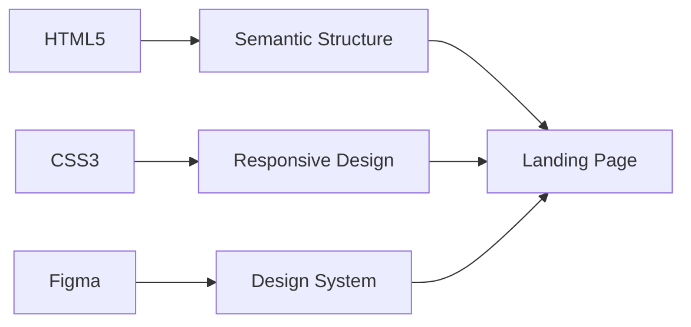

<div align="center">

# 🎧 Holberton School Headphones

[](https://developer.mozilla.org/en-US/docs/Web/HTML)
[](https://developer.mozilla.org/en-US/docs/Web/CSS)
[](https://web.dev/responsive-web-design-basics/)

</div>

<div align="center">


</div>


## 🎯 Project Objective

The goal of this project is to create a responsive landing page for headphones using only HTML and CSS. This is a design implementation exercise that focuses on:

This project focuses on implementing a modern headphones landing page with emphasis on:

- 🎨 **Design Fidelity** - Pixel-perfect implementation of Figma mockups
- 📱 **Responsive Design** - Seamless adaptation across all devices
- ⚡ **Performance** - Pure CSS with zero external dependencies
- 🧹 **Clean Code** - Semantic HTML and maintainable CSS architecture

## 🎨 Design

| **Designer** | **Type** | **Mockups** |
|--------------|----------|-------------|
| Nicolas Philippot | Static Webpage | [View on Figma](https://www.figma.com/design/FfnVADRC9xgI3yiZliTBYZ/Holberton-School---Headphone-company?node-id=0-1&p=f&t=wrBS2d43pBGyfqDY-0) |

## 🛠️ Tech Stack



## 🚀 Quick Start

```bash
# Clone & run
git clone https://github.com/holbertonschool/holbertonschool-headphones.git
cd holbertonschool-headphones
open index.html
```

## 📁 Project Structure

```
holbertonschool-headphones/
├── 📄 index.html          # Main landing page
├── 🎨 styles.css          # Responsive CSS styles
└── 📸 images/             # High-res headphone assets
    ├── 01_headphones_desktop@2x.png
    ├── 01_headphones_tablet@2x.png
    └── 01_headphones_mobile@2x.png
```

## ✅ Requirements

| **Constraint** | **Status** |
|----------------|------------|
| No external CSS frameworks | ✅ Pure CSS |
| No JavaScript | ✅ HTML/CSS only |
| Responsive design | ✅ Mobile-first |
| Design fidelity | ✅ Pixel-perfect |

## 🎨 Design Specifications

### 📱 Responsive Breakpoints
```css
/* Mobile First Approach */
@media (max-width: 480px) {
  /* Mobile styles */
}
```

### 🎯 Interactive States
```css
/* Links */
a:hover, a:active { color: #FF6565; }

/* Buttons */
button:hover, button:active { opacity: 0.9; }
```

### 📐 Layout Constraints
- **Max width**: `1000px`
- **Alignment**: `center`
- **Container**: `margin: 0 auto`

## 🤝 Contributing

```bash
# 1. Fork the repository
# 2. Create your feature branch
git checkout -b feature/amazing-feature

# 3. Commit your changes
git commit -m 'Add amazing feature'

# 4. Push to the branch
git push origin feature/amazing-feature

# 5. Open a Pull Request
```

---

<div align="center">

### 🎧 **Headphones Design & Development**

**by Charlène Billot-MORNET**

[](https://linkedin.com/in/charlène-billot-mornet)
[](https://github.com/knarta)

</div>